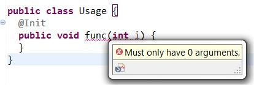

# Deannotation Checker
[](https://travis-ci.org/XDean/Deannotation-checker)
[](https://codecov.io/gh/XDean/deannotation-checker/branch/master)

Dean Checker Framework

Get the error in advance at compile period!

- [Get Start](#get-start)
- [Sample](#sample-usage)
- [Features](#features)
  - [`@CheckType`](#checktype)
  - [`@CheckAnnotation`](#checkannotation)
  - [`@CheckModifier`](#checkmodifier)
  - [`@CheckClass`](#checkclass)
  - [`@CheckField`](#checkfield)
  - [`@CheckMethod`](#checkmethod)
  - [`@CheckParam`](#checkparam)
- [Convention](#convention)

# Get Start

```xml
<dependency>
  <groupId>com.github.XDean</groupId>
  <artifactId>deannotation-checker</artifactId>
  <version>0.2.0-SNAPSHOT</version>
</dependency>
```

<sub>Note that if you use SNAPSHOT version, you should ensure sonatype snapshot repository in your repositories list `https://oss.sonatype.org/content/repositories/snapshots/com/github/XDean/deannotation-checker/0.2.0-SNAPSHOT/`</sub>

and you may need to read [Use Meta Annotation](https://github.com/XDean/AnnotationProcessorToolkit/blob/master/doc/Meta.md#use-meta-annotation) to understand how to use meta-annotation.

# Sample Usage

```java
@CheckMethod(argCount = 0, returnType = @CheckType(void.class))
public @interface Init {
   ...
}
```

```java
@Init
public void func(int i) { // this line will give compile error '[5,15] Must only have 0 arguments'
   ...
}
```

## eclipse snapshot



# Features
  
## `CheckType` 

[Sample Code](src/test/resources/xdean/deannotation/checker/checkType)

Check the annotated element's type. Usually not use alone but in other check annotation. 

Note it's different with `@CheckClass`. `@CheckClass` check the class itself, while `CheckType` only check the type use.

### Attributes

| Name | Type |  Default | Description |
| -- | -- | -- | -- |
| value | `Class[]` | `{Irrelevant}` | target type, if it contains `Irrelevant`, the check will always pass |
| type | `Type` | `EQUAL` | check type |

### Type

1. `EQUAL`, the type must equals target type, only support one target type
2. `SUPER`, the type must assignable from target type, only support one target type
3. `EXTEND_ONE`, the type must assignable to all the target types
4. `EXTEND_ALL`, the type must assignable to one of the target types

## `CheckAnnotation`

[Sample Code](src/test/resources/xdean/deannotation/checker/checkAnnotation)

### Attributes

| Name | Type |  Default | Description |
| -- | -- | -- | -- |
| require | `Class<? extends Annotation>[]` | `{}` | required annotations |
| forbid | `Class<? extends Annotation>[]` | `{}` | forbidden annotations |

## `CheckModifier`

[Sample Code](src/test/resources/xdean/deannotation/checker/checkModifier)

### Attributes

| Name | Type |  Default | Description |
| -- | -- | -- | -- |
| require | `Modifier[]` | `{}` | required modifiers |
| forbid | `Modifier[]` | `{}` | forbidden modifiers |

## `CheckClass`

[Sample Code](src/test/resources/xdean/deannotation/checker/checkClass)

### Attributes

| Name | Type |  Default | Description |
| -- | -- | -- | -- |
| implement | `Class<?>[]` | `{}` | check the class implements(extends) all the classes |
| modifier | `CheckModifier` | `@CheckModifier` | check the class's modifiers |
| annotation | `CheckAnnotation` | `@CheckAnnotation` | check the class's annotations |

## `CheckField`

[Sample Code](src/test/resources/xdean/deannotation/checker/checkField)

### Attributes

| Name | Type |  Default | Description |
| -- | -- | -- | -- |
| type | `CheckType` | `@CheckType` | check the field's type |
| modifier | `CheckModifier` | `@CheckModifier` | check the field's modifiers |
| annotation | `CheckAnnotation` | `@CheckAnnotation` | check the field's annotations |

## `CheckMethod`

[Sample Code](src/test/resources/xdean/deannotation/checker/checkMethod)

### Attributes

| Name | Type |  Default | Description |
| -- | -- | -- | -- |
| modifier | `CheckModifier` | `@CheckModifier` | check the method's modifiers |
| annotation | `CheckAnnotation` | `@CheckAnnotation` | check the method's annotations |
| returnType | `CheckType` | `Irrelevant` | check the method's return type |
| argCount | int | -1 | method must have exactly parameter count if the value is not negative |
| argTypes | `CheckParam[]` | `{}` | check parameters with one to one correspondence<br>`argTypes` length can't more than `argCount` if it is not negative |

## `CheckParam`

[Sample Code](src/test/resources/xdean/deannotation/checker/checkParam)

### Attributes

| Name | Type |  Default | Description |
| -- | -- | -- | -- |
| type | `CheckType` | `@CheckType` | check the parameter's type |
| annotation | `CheckAnnotation` | `@CheckAnnotation` | check the parameter's annotations |

# Convention

1. Check annotation any attribute has default value.
2. Empty check annotation will not do any check
3. Check annotation only check matched element. That means `@CheckMethod` will not check `Field` even if annotated on `Field`.
